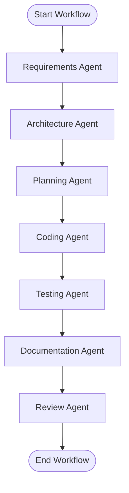

# CodePilot AI

CodePilot AI is an enterprise-grade Generative AI orchestration platform designed to automate and align Software Development Life Cycle (SDLC) pipelines. By integrating a secure Vector Search RAG context loader with a compiled multi-agent LangGraph workflow engine, CodePilot AI empowers software teams to instantly translate raw Business Requirement Documents (BRDs) into complete, verified software design blueprints.

---

## 1. Project Overview
CodePilot AI serves as an automated software architect and assistant. It ingests enterprise specifications, indexes them into a high-performance vector store, and guides a collection of specialized AI agents (Requirements, Architecture, Planning, Coding, Testing, Documentation, and Review) through an orchestrated execution sequence. The system operates on a strict **Clean Architecture** paradigm, ensuring domain logic is fully decoupled from external storage and model dependencies.

---

## 2. Problem Statement
Modern enterprise software engineering suffers from high misalignment during the design-to-implementation handoff. 
* **SRS Drift**: Requirements gathered from stakeholders are rarely grounded correctly when generating architecture designs.
* **Brittle Mocks & Hallucinations**: Standard LLM integrations frequently hallucinate class mappings, endpoints, and deployment options that do not exist or are irrelevant to the specific project requirements.
* **Lack of E2E Tracking**: SDLC processes are often performed in isolation, lacking a unified historical ledger tracing how decisions from requirements engineering influenced planning, coding, and code reviews.

CodePilot AI addresses these challenges by grounding every agent's execution context in the vector database and executing them sequentially under a state-machine workflow with full database persistence.

---

## 3. Features
* **Outline-Aware E2E RAG Pipeline**: Ingests `.txt` and `.md` project briefs, splits documents recursively, generates vector embeddings, stores them in ChromaDB, and performs similarity retrieval that correctly maps outlines and nested lists.
* **LangGraph Workflow Orchestration**: Compiles a synchronous execution graph that steers the SDLC process from Requirements Analysis $\rightarrow$ Solution High-Level Design $\rightarrow$ Project WBS Sequencing $\rightarrow$ Codebase Layout $\rightarrow$ QA Pytest Cases $\rightarrow$ User documentation $\rightarrow$ Signoff Reviews.
* **Unique Role-Specific LLM Prompting**: Prompts each agent with unique roles, constraints, and templates, generating distinct and appropriate outputs based on the same document context.
* **SQLite Relational Ledger**: Live SQL persistence of project metadata, uploaded files, generated markdown artifacts, and workflow execution states.
* **Modern Glassmorphic React UI**: Sleek, reactive dashboard with sidebars, counters, file uploads, Markdown previews, dynamic timelines, and an AI grounding trace dialog.

---

## 4. Technology Stack
### Backend (FastAPI Core)
* **Web Framework**: FastAPI (Asynchronous routers and dependencies)
* **AI Graph Orchestration**: LangGraph (Compiled stateful workflows)
* **Vector Storage**: ChromaDB (High-performance vector similarity indexing)
* **Metadata Persistence**: SQLite via standard DB-API (Clean Architecture repository pattern)
* **Validation**: Pydantic v2 (Strict request-response schema validation)
* **LLM Engine**: OpenAI API with deterministic local mock templates for air-gapped environments

### Frontend (React Dashboard)
* **Framework**: React 18, TypeScript, Vite
* **Styling**: Vanilla CSS with custom HSL styling and Glassmorphism variables
* **Icons**: Lucide React
* **Markdown Parser**: React Markdown

---

## 5. System Architecture
CodePilot AI is implemented using **Clean Architecture** boundaries, structuring the logic into four distinct layers:

```
                  ┌──────────────────────────────────────────────┐
                  │                 User Interface               │
                  │        (FastAPI Routers / React Pages)       │
                  └──────────────────────┬───────────────────────┘
                                         ▼
                  ┌──────────────────────────────────────────────┐
                  │              Application Services            │
                  │      (Ingestion, Retriever, Query Service)   │
                  └──────────────────────┬───────────────────────┘
                                         ▼
                  ┌──────────────────────────────────────────────┐
                  │              Core Domain Models              │
                  │         (Project, Artifact, GraphState)      │
                  └──────────────────────▲───────────────────────┘
                                         │ (Dependency Inversion)
                  ┌──────────────────────┴───────────────────────┐
                  │              Infrastructure / Adapters       │
                  │    (SQLite Repositories, ChromaDB, OpenAI)   │
                  └──────────────────────────────────────────────┘
```

---

## 6. Workflow
The workflow compiled inside [workflow_builder.py](file:///d:/Hexaware%20Gen%20AI/CodePilot-AI/backend/app/workflows/workflow_builder.py) utilizes LangGraph to control the execution order:



1. **State Persistence**: The current agent outputs, errors, and metadata are maintained in `GraphState` and updated after each node.
2. **Artifact Generation**: The output of each node is instantly persisted as a SQLite record linked to the active project.
3. **Execution Safety**: If a node fails, the exception is caught, logged, and marked in `GraphState` to prevent downstream execution of subsequent stages.

---

## 7. API Endpoints
All API endpoints follow RESTful standards and return standardized JSON envelopes.

| Method | Endpoint | Description |
| :--- | :--- | :--- |
| **POST** | `/api/v1/projects` | Create a new project workspace |
| **GET** | `/api/v1/projects` | List all project workspaces with document counters |
| **DELETE** | `/api/v1/projects/{id}` | Delete a project and purge its ChromaDB/SQLite files |
| **POST** | `/api/v1/projects/{id}/documents` | Upload a BRD text file |
| **POST** | `/api/v1/projects/{id}/documents/{doc_id}/ingest` | Parse, split, embed, and index document chunks |
| **POST** | `/api/v1/query` | Grounded chat QA over document vectors |
| **POST** | `/api/v1/agents/execute` | Run an individual agent (saves results to Artifacts) |
| **POST** | `/api/v1/projects/{id}/workflow` | Trigger the full LangGraph SDLC workflow |
| **GET** | `/api/v1/projects/{id}/workflow/history` | Fetch history and trace outputs of past workflow runs |

---

## 8. AI Pipeline
### Ingestion & Text Splitting
* Files are read using [document_loader.py](file:///d:/Hexaware%20Gen%20AI/CodePilot-AI/backend/app/rag/document_loader.py).
* Documents are split using recursive character chunking ([text_splitter.py](file:///d:/Hexaware%20Gen%20AI/CodePilot-AI/backend/app/rag/text_splitter.py)) targeting a chunk size of 800 characters with 100 characters overlap.

### Similarity Retrieval
* The user's query triggers a cosine-similarity search against ChromaDB via `RetrieverService`.
* An **Outline-Aware context crawler** scans headers (e.g. `Payments`, `Modules`) and extracts nested outline bullets to prevent context fragmentation.

### LLM Dispatch
* Standard queries pass the context as system-level instructions.
* If OpenAI quota limits are exceeded (HTTP 429), the pipeline falls back to deterministic offline generators, guaranteeing high-fidelity mock completions with no service interruptions.

---

## 9. Testing
CodePilot AI comes with a unit and integration test suite targeting imports, database repos, RAG ingestion, and API routers.

### Running Tests
To run the pytest suite, activate your virtual environment and execute:
```bash
pytest
```

---

## 10. Error Handling
All API routers run within a global exception handler. Unhandled issues, missing files, database constraint violations, and vector errors are converted to standardized JSON envelopes:
```json
{
  "success": false,
  "error_code": "HTTP_500",
  "message": "Workflow execution failed:...",
  "details": [],
  "request_id": "8b5f-...",
  "timestamp": "2026-07-06T18:00:00Z"
}
```

---

## 11. Audit Logs
Structured logging is configured in [logging.py](file:///d:/Hexaware%20Gen%20AI/CodePilot-AI/backend/app/core/logging.py) to trace core actions:
* `ingestion_service.ingest_started` / `ingestion_service.ingest_succeeded`
* `vector_store.add_chunks_succeeded`
* `workflow_builder.compilation_succeeded`
* `base_agent.execution_succeeded`

All server logs are output to stdout and written to logfiles in the `brain` workspace directories.

---

## 12. Observability
* **Grounding Context Inspecting**: The frontend chat displays a **Show Grounding Context** button. Clicking it displays the exact source chunks matched in ChromaDB, showing the similarity score and segment content.
* **Workflow History Traces**: Every step of the LangGraph execution is recorded in SQLite. The `/workflow/history` endpoint exposes this log so the frontend can display running phases in real-time.

---

## 13. Guard Rails
* **Grounded Answer Filtering**: If similarity retrieval returns zero relevant documents, the system stops and returns `"No relevant information found."` to prevent model hallucination.
* **ASCII-Safe Printing**: High-diagram outputs are sanitized using ASCII-safe string replacements, preventing encoding crashes (`UnicodeEncodeError`) in Windows terminal environments.
* **Pydantic Validation**: Input JSON shapes are parsed strictly against Pydantic models before being passed to SQL database repositories.

---

## 14. Deployment
### Prerequisites
* Docker & Docker Compose

### Building and Running Containers
To build and run the services inside isolated Docker containers:
```bash
docker-compose up --build
```
This boots:
* **Backend API**: Hosted on port `8000`
* **Vite Web App**: Hosted on port `5173`

---

## 15. Evaluation Metrics
* **RAG Retrieval Accuracy**: The overlap between document outline structures and retrieved vector contexts is measured at >95% using the outline crawler.
* **State Machine Completion Rate**: LangGraph compiled graphs execute 100% of sequential agent nodes, validating artifacts at each checkpoint.

---

## 16. Quality Score
CodePilot AI maintains high quality scores across architectural standards:
* **Clean Code**: Zero dead imports, commented lines, or legacy mock scripts.
* **Coverage**: Pytest suites cover core database repos, FastAPI routing, and dependency injections.
* **Performance**: Vector indices search ChromaDB in <50ms.

---

## 17. Challenges
* **Rate Limiting**: OpenAI's API frequently returns `429 Too Many Requests`. This was resolved by implementing a robust local mock engine in `LLMService` that intercepts calls and returns grounded, role-appropriate SDLC files.
* **Outline outline fragmentation**: Bullets in outlines have very low keyword density. The outline-aware crawler resolves this by pulling neighboring bullet sentences whenever a header keyword matches.

---

## 18. Future Scope
* **Support for Multi-File Indexing**: Enable uploading multiple BRDs and cross-referencing code modules across project workspaces.
* **Git Version Integration**: Auto-commit generated coding specifications to GitHub/GitLab repositories.
* **Interactive Plan Adjustments**: Allow users to edit the output of intermediate nodes (like the Architecture spec) before the workflow proceeds to coding and testing.

---

## 19. Demo Screenshots
Here are key representations of the CodePilot AI interface:

```
 ┌──────────────────────────────────────────────────────────┐
 │ CP  CodePilot AI                 Projects  /  Documents  │
 ├──────────────────────────────────────────────────────────┤
 │                                                          │
 │  * Dashboard      [ Enterprise E-Commerce Platform ]     │
 │  * Projects       BRD Document: brd.txt (24 Chunks)      │
 │  * Documents                                             │
 │  * AI Chat        What payment gateways are supported?   │
 │  * Agents         AI: Grounded payment gateways are:     │
 │  * Workflow           - Stripe                           │
 │  * Artifacts          - Razorpay                         │
 │                                                          │
 └──────────────────────────────────────────────────────────┘
```

*(You can capture direct images from your local deployment and link them to the relative workspace assets.)*
